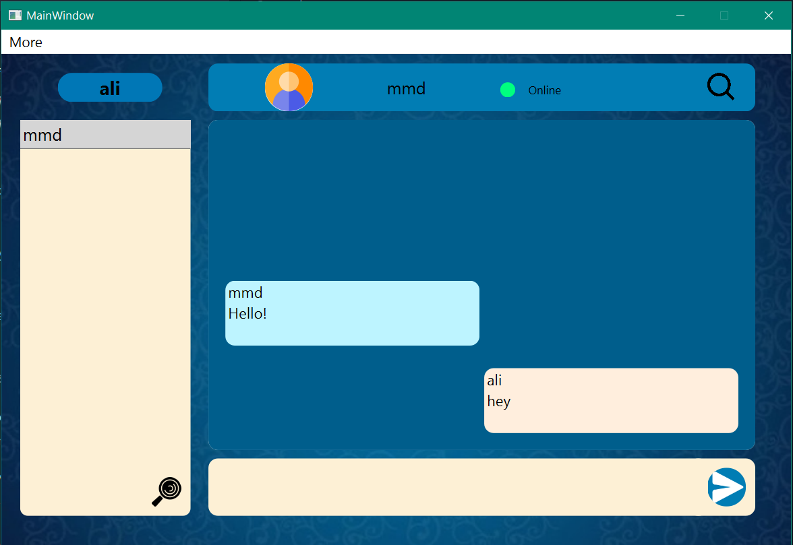
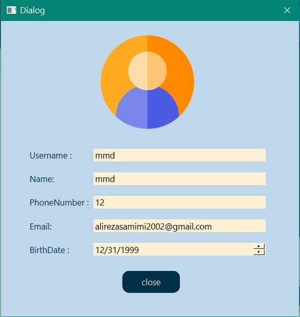
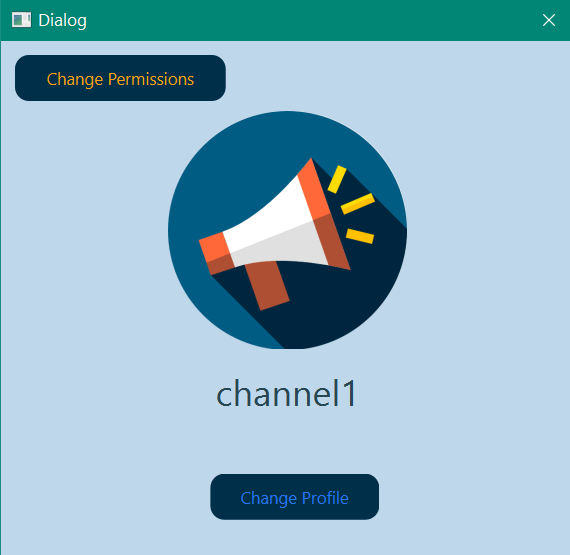

This project is a simple c++ messenger desktop app developed with QT framework.

We used qtcpsocket, qtcpserver and qthread as main libraries. 

This project uses https://github.com/xcoder123/SimpleSmtp_SSL_QT5 for sending email via gmail smtp server,
and https://github.com/bricke/Qt-AES for encryption in sending and recieving data through tcp socket and writing and reading data from database.

The database of this project is based on JSON files and there are some main features of this project:
- sending and recieving messages in one time.
- creating groups and channels.
- setting admins for channels.
- editing, saving and forwarding messages.
- searching through messages in a chat.

and here are some of the pictures of UI

